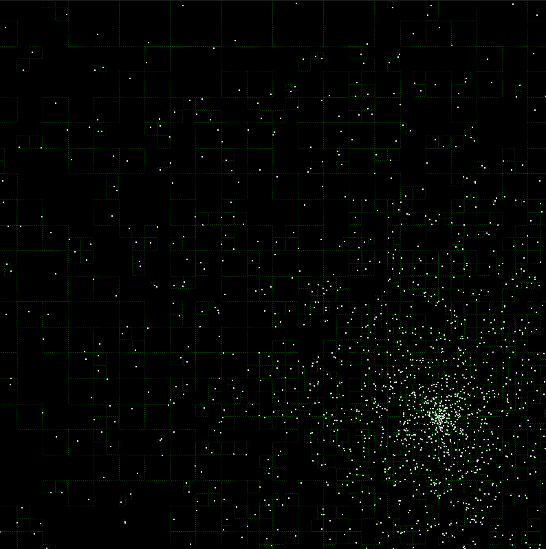

An untuned 2D N-body gravity simulation implementing the Barnes-Hut method and a simple QT GUI. 
The Barnes-Hut algorithm and quadtree implementation was based on [this](https://lisyarus.github.io/blog/programming/2022/12/21/quadtrees.html) beautiful article.
Supports a few thousands particles in real time (30-60 fps @ 3.8 GHz AMD Ryzen 3900X). 

Build with `cmake --build projdir\cmake-build-release`.

